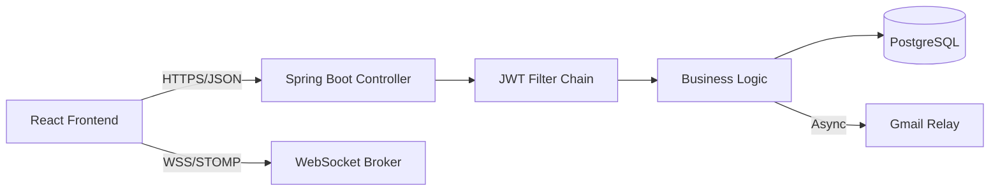

```markdown
<div align="center">
  <br />
  <h1>💘 LoveLink</h1>
  <h3>The "Monolith" Modernized.</h3>
  <p>
    <b>Real-Time Matchmaking & Social Discovery Platform</b>
  </p>
  
  <p>
    A full-stack social application that bridges the gap between traditional monolithic architectures and modern SPAs using a <b>Single Artifact Deployment</b> strategy.
  </p>

  <p>
    
    
    
    
    
  </p>

  <p>
    <a href="https://love-link-1759327457370.azurewebsites.net/"><strong>🚀 View Live Demo</strong></a>
    <br />
    <sub><em>⚠️ Hosted on Azure Free Tier. Please allow ~30 seconds for the "Cold Start" warm-up.</em></sub>
  </p>
  <br />
</div>

---

## 📸 Application Visuals

> **Design Philosophy:** A seamless, reactive UI served directly by a robust Spring backend.

<table>
  <tr>
    <td align="center" width="33%"><b>🔥 Smart Matching</b></td>
    <td align="center" width="33%"><b>💬 Real-Time Chat</b></td>
    <td align="center" width="33%"><b>🛡️ Admin Control</b></td>
  </tr>
  <tr>
    <td></td>
    <td></td>
    <td></td>
  </tr>
  <tr>
    <td><em>Tinder-style card stack with optimistic UI updates.</em></td>
    <td><em>Instant messaging powered by STOMP & WebSockets.</em></td>
    <td><em>RBAC-protected dashboard for user management.</em></td>
  </tr>
</table>

<table>
  <tr>
    <td align="center" width="33%"><b>🧩 Matches & Grid</b></td>
    <td align="center" width="33%"><b>📅 Activity History</b></td>
    <td align="center" width="33%"><b>🎲 Random Discovery</b></td>
  </tr>
  <tr>
    <td></td>
    <td></td>
    <td></td>
  </tr>
</table>

---

## 🏗️ Technical Architecture

This project moves away from the complexity of managing two separate deployments (Frontend vs Backend) in favor of a **Unified Build Pipeline**.



### ⚡ Key Engineering Features

* **Unified Deployment:** The React build (`npm run build`) is automatically copied into `src/main/resources/static` during the Maven build lifecycle. The result is a **single executable JAR** that serves both the API and the UI.
* **Security First:**
* **Stateless Auth:** Custom JWT implementation with filter chains.
* **Rate Limiting:** Integrated **Bucket4j** to protect endpoints from brute-force and DDoS attacks.
* **Strict Validation:** `@Valid` DTOs prevent malformed data from reaching the service layer.


* **Real-Time Capabilities:**
* Utilizes **Spring WebSocket** with a STOMP broker for bi-directional chat.
* Frontend manages socket subscriptions via React Context to prevent connection leaks.


---

## 🛠️ Getting Started

### Prerequisites

* **Java 17+**
* **Maven 3.x**
* *(Node.js is handled automatically by the frontend-maven-plugin)*

### Run Locally

1. **Clone the Repo**
```bash
git clone [https://github.com/DakshArora342/LoveLink.git](https://github.com/DakshArora342/LoveLink.git)
cd LoveLink

```


2. **Build & Run (One Command)**
```bash
mvn clean spring-boot:run

```


*This will install Node, build React, package the JAR, and start the server.*
3. **Access**
* Application: `http://localhost:8080`
* Swagger Docs: `http://localhost:8080/docs`


---

## 🔮 Future Roadmap

* [ ] **Dockerization:** Containerize the unified JAR for easier cloud deployment.
* [ ] **OAuth2:** Add "Sign in with Google" support.
* [ ] **Redis:** Offload WebSocket session state to Redis for horizontal scaling.

---

<div align="center">
<p>
Created by <b>Daksh Arora</b>
</p>
<p>
<a href="https://www.google.com/search?q=https://www.linkedin.com/in/daksharora342"></a>
<a href="mailto:aroratheaksh@gmail.com"></a>
</p>
</div>

```
